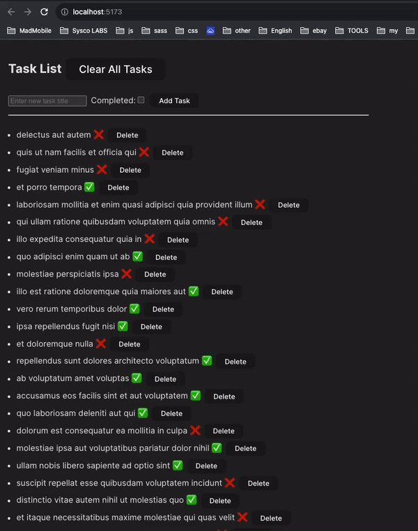

# React - Redux Toolkit Todo CRUD App

Welcome to the React Redux Toolkit Todo CRUD App! This project demonstrates how to create a Todo management application using Redux Toolkit for efficient state management.



## Table of Contents

- [Overview](#overview)
- [Features](#features)
- [Installation](#installation)
- [Usage](#usage)
- [Accessing the Source Code](#accessing-the-source-code)
- [Contributing](#contributing)
- [License](#license)

## Overview

This application showcases how to leverage Redux Toolkit, a powerful state management library, to create a complete Todo CRUD (Create, Read, Update, Delete) application. It covers fetching tasks from an API, adding new tasks, updating task titles, marking tasks as completed or incomplete, and deleting tasks.

## Features

- Fetch tasks from an external API
- Add new tasks with completion status
- Update task titles
- Mark tasks as completed or incomplete
- Delete tasks

## Installation

1. Clone the repository:

   ```bash
   git clone https://github.com/abhimax/todos-crud-redux-tk

   ```

2. Navigate to the project directory:

   ```bash
   cd todos-crud-redux-tk

   ```

3. Install dependencies:
   ```bash
   npm install
   ```

## usage

To start the application locally

1. Install dependencies:
   ```bash
   npm run dev
   ```

Open your browser and navigate to http://localhost:5173/ to access the application.

## accessing-the-source-code

To explore the source code and delve into the project details, visit the GitHub repository:
https://github.com/abhimax/todos-crud-redux-tk

## contributing

Contributions are welcome! If you find issues or have suggestions, feel free to submit a pull request.

## license

This project is licensed under the MIT License.
